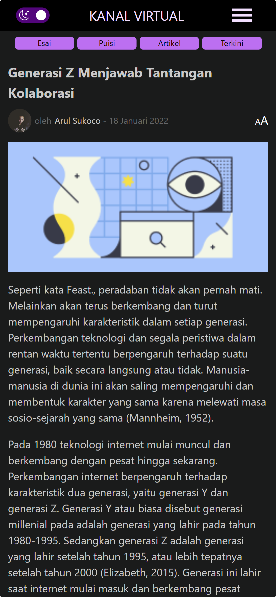
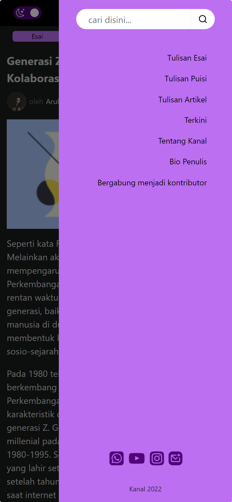

# ROSE THEME APPLICATION

## Tampilan Aplikasi

1. Tampilan Halaman beranda

   <!-- prettier-ignore -->
    

       
       </img>
       
       </img>
   

2. Tampilan halaman post dan navbar

   

       
       </img>
       
       </img>
    

#

## Teknologi yang di gunakan

- [NextJs](https://nextjs.org/) untuk SSR (Server Side Rendering)
- [Strapi V3](https://docs-v3.strapi.io/developer-docs/latest/getting-started/introduction.html) headless CMS untuk content post manager
- [Bootstrap 5](https://getbootstrap.com/docs/5.0/getting-started/introduction/) handle navbar
- [StyledComponents](https://styled-components.com/) CSS-in-JS wihtout camelCased rules
- [FIGMA](https://styled-components.com/) high fidelity wireframes

### Artikel

- [NextJs Documentation](https://nextjs.org/docs/getting-started)
- [Website MDN (Java Script)](https://developer.mozilla.org/en-US/docs/Web/HTML)
- [Stack Overflow](https://stackoverflow.com/)

### Video

- [Tutorial Membuat Full-stack Blog Dengan Strapi & Next JS Server-side Rendering](https://www.youtube.com/watch?v=qkHkGq7kCdU&t=7328s)

<!-- prettier-ignore-end -->

<!-- ALL-CONTRIBUTORS-LIST:END -->

---

Dibuat menggunakan NextJS. Kode berlisensi dibawah [MIT License](https://github.com/faruqmaulana/rose-theme-application/main/LICENSE)
